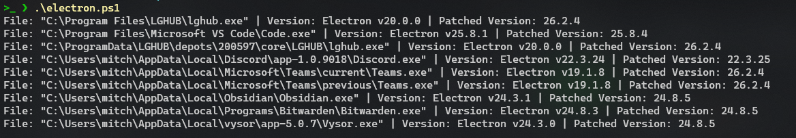

# Find Electron Apps Vulnerable to CVE-2023-4863 / CVE-2023-5129

This PowerShell script downloads [Sysinternals Strings](https://learn.microsoft.com/en-us/sysinternals/downloads/strings), recursively searches for strings within all `.exe` files across all drives, and compares the Electron version found with known patched versions below to determine vulnerability to [CVE-2023-4863](https://nvd.nist.gov/vuln/detail/CVE-2023-4863) / [CVE-2023-5129](https://nvd.nist.gov/vuln/detail/CVE-2023-5129).

> **Note:**
> 
> The script downloads `strings.zip` to `C:\Windows\Temp` and extracts `strings.exe` from it. The user running the script needs permissions for this folder. If you're using an RMM tool, there should be no issues since it runs as SYSTEM or an admin account. But if you're running it locally, you might need to open the folder in Explorer to grant necessary permissions..

## Vulnerability patched in Electron Versions

### Stable

* [26.2.4 - Patch Notes](https://releases.electronjs.org/release/v26.2.4)
* [25.8.4 - Patch Notes](https://releases.electronjs.org/release/v25.8.4)
* [24.8.5 - Patch Notes](https://releases.electronjs.org/release/v24.8.5)
* [22.3.25 - Patch Notes](https://releases.electronjs.org/release/v22.3.25)

### Pre Release

* [27.0.0-beta.8 - Patch Notes](https://releases.electronjs.org/release/v27.0.0-beta.8)

## Output

The script generates a list each time it discovers a vulnerable file, including the found file, its vulnerable version, and the corresponding updated version that addresses the issue.

